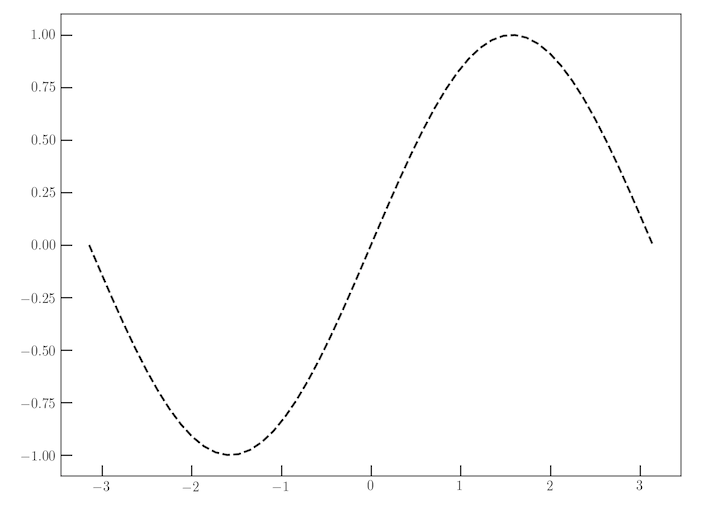

# matplotlib_curve_maker

> 70\% done, not totally functional yet

This is pretty much for personal use for when I'm thinking about simple numerical models. The dream is to be plotting something, i.e.

```python
import numpy as np
import matplotlib.pyplot as plot

x = np.linspace(-np.pi, np.pi)
y = np.sin(x)

plt.plot(x,y)
```


You run this through your model. Suddenly, you get an idea.

> What does your model say, if this function starts declining on the right side?

So you import this package, run some stuff.

```
import matplotlib_curve_maker

ax = plt.gca()
points, = ax.plot([], [], 'o', c=color_cycle[1], markersize=6) # empty points
line, = ax.plot([], [], '-' , c=color_cycle[1] ) # empty line
linebuilder = LineBuilder(ax, points, line)

```

A window pops up. You have some keyboard controls.
* `i` to add a point where the mouse is.
* `d` to delete the point under the mouse.
* Click and drag points to move them around.

Then you press `spacebar` and the suddenly, `linebuilder.get_spline()` returns an anonymous function that is the blue spline you see above!
